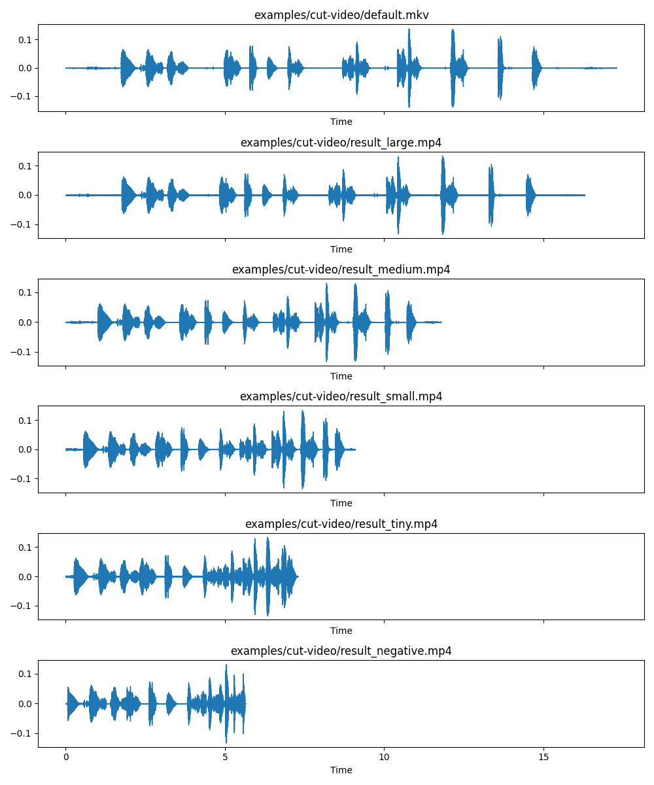

# `cut-video` examples

Some examples, changing the `distance` parameter.

- `default.mkv`: The original file
  - Duration: 17 secs
- `result_negative.mp4`: `-d negative`
  - Duration: 05 secs
- `result_tiny.mp4`: Default cuts
  - Duration: 07 secs
- `result_small.mp4`: `-d small`
  - Duration: 09 secs
- `result_medium.mp4`: `-d medium`
  - Duration: 11 secs
- `result_large.mp4`: `-d large`
  - Duration: 16 secs
  
  

All these examples using defaults parameters to `threshold`, `silence-time`, `bitrate` and `codec`.

The `--preset` used is `ultrafast`

Example command:

```bash
vmh cut-video default.mkv result_large.mp4 -p ultrafast -d large
```
